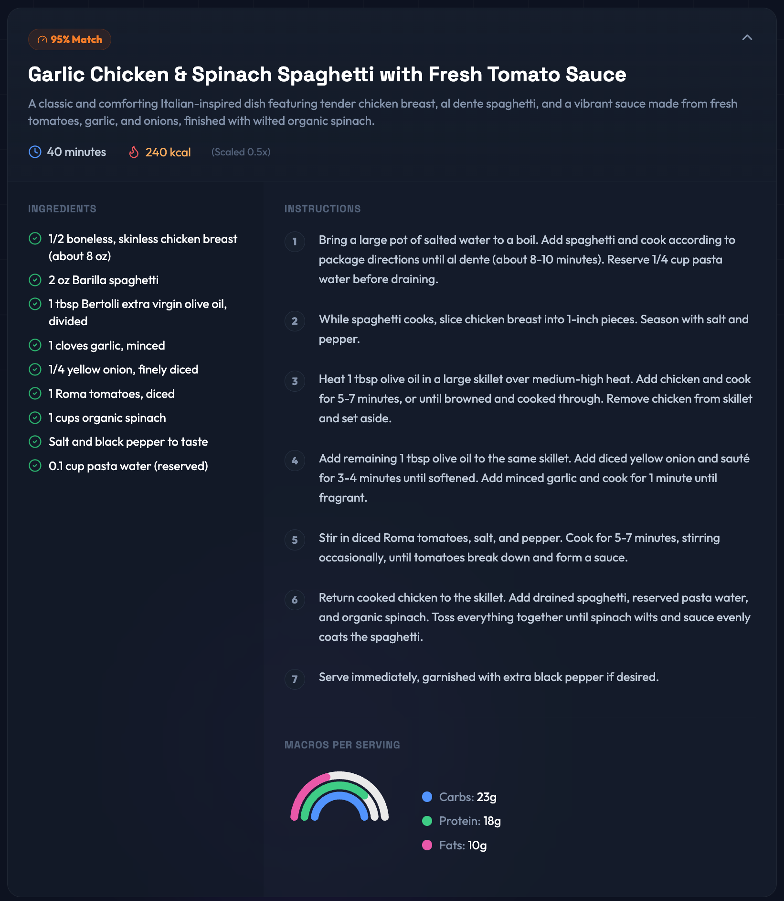
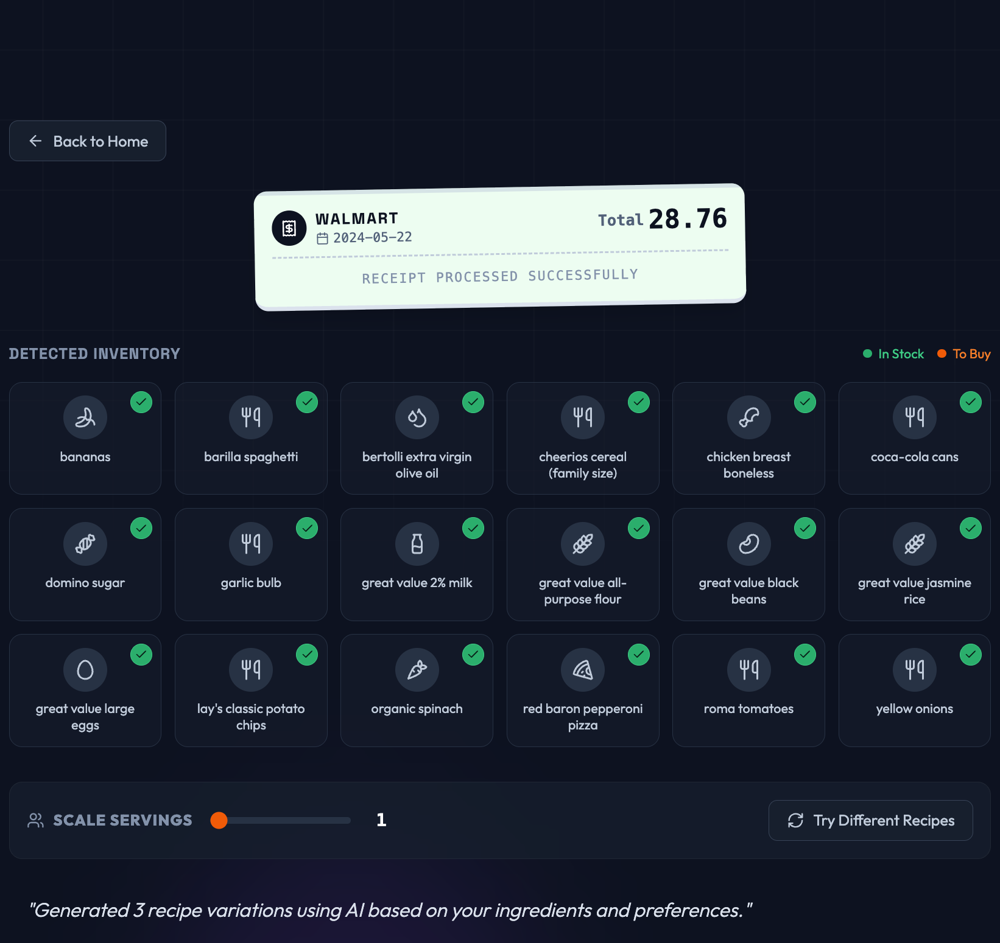
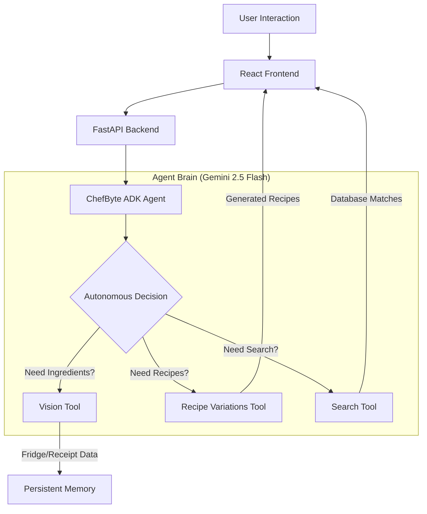

# ChefByte 🍳 | SnackOps Project

### The Ultimate AI-Powered Culinary Agent for Modern Households

**Built with Google Agentic Development Kit (ADK) & Gemini 2.5 Flash**

> An intelligent, agentic meal planning companion that transforms your fridge contents and receipts into personalized, chef-curated meal plans using advanced multi-modal AI.

[](https://github.com/google/adk)
[](https://deepmind.google/technologies/gemini/)
[](https://reactjs.org/)
[](https://fastapi.tiangolo.com/)

---

## 🎯 Overview

**ChefByte** is the next evolution of the **SnackOps** project, reimagined as a fully agentic system. It moves beyond simple recipe search to true autonomous decision-making.

Powered by **Google's Agentic Development Kit (ADK)** and **Gemini 2.5 Flash**, ChefByte doesn't just follow scripts—it *thinks*. It analyzes your ingredients, understands your dietary needs, and autonomously selects the best tools to generate culinary masterpieces.

### What's New in v2.0?

🚀 **True Agentic Core** - Gemini autonomously decides which tools to use (Vision, Search, Variations) based on your request.  
🧾 **Receipt Scanning** - Scan grocery receipts to instantly digitize your inventory and track spending.  
🎨 **Modern React UI** - A stunning, responsive interface with glassmorphism design and smooth animations.  
🔄 **Smart History** - Remembers your past generations and keeps your inventory synced.  
⚡ **Performance Optimized** - Generates 3 recipe variations in seconds using parallel tool execution.

---

## Why ChefByte?

### The Problem
Modern households struggle with three daily questions:
1. "What's in my fridge?"
2. "What can I cook with this?"
3. "How do I make it healthy?"

Traditional recipe apps are static databases. They don't know your inventory, your dietary needs, or your cooking style.

### Our Solution
We built ChefByte to be an **active kitchen companion**, not a passive database. By leveraging **Agentic AI**, ChefByte understands context. It sees your ingredients, reads your receipts, and thinks like a chef to create personalized meal plans that reduce food waste and decision fatigue.

### Why You Should Use It
- **Reduce Food Waste**: Instantly find recipes for ingredients about to expire.
- **Save Money**: Digitizing receipts helps you track inventory and avoid overbuying.
- **Eat Healthier**: Automatic macro tracking ensures you meet your nutrition goals.
- **Save Time**: Stop scrolling through recipe blogs. Get 3 perfect options in seconds.

---

## Compatibility


ChefByte is designed to run locally on your machine for maximum privacy and performance.

| OS | Status | Notes |
| :--- | :--- | :--- |
| **macOS** | ✅ Verified | Native support (Apple Silicon & Intel) |
| **Windows** | ✅ Verified | Supports WSL2 and PowerShell |
| **Linux** | ✅ Verified | Ubuntu, Debian, Fedora, Arch |

**Requirements:**
- **RAM**: 4GB minimum (8GB recommended)
- **Python**: 3.12 or higher
- **Node.js**: v18 or higher
- **Internet**: Required for Gemini API access

---

## 📸 Interface Showcase

<div align="center">
  
</div>

<div align="center" style="display: flex; gap: 20px; justify-content: center;">
  
  
</div>

<br/>

---

## Key Features

### 1. Agentic Intelligence
ChefByte isn't a chatbot. It's an agent.
- **Autonomous Tool Selection**: It decides when to use vision, when to search, and when to generate variations.
- **Strategic Reasoning**: It explains *why* it chose specific recipes based on your ingredients.
- **Fallback Mechanisms**: Robust error handling ensures you always get a result.

### 2. Multi-Modal Vision
- **Fridge Scanner**: Identify ingredients from a messy fridge photo.
- **Receipt Digitizer**: Extract items, prices, and store details from grocery receipts.
- **Auto-Detection**: The system automatically figures out if you uploaded a fridge photo or a receipt.

### 3. Smart Recipe Generation
Get 3 distinct variations for every request:
- **Standard**: A classic, well-balanced meal.
- **Creative Twist**: A fusion or innovative take on the ingredients.
- **Quick & Easy**: A simplified version for busy days.

### 4. Nutrition & Health
- **Macro Tracking**: Calories, Protein, Carbs, and Fats calculated for every recipe.
- **Dietary Filters**: Vegetarian, Vegan, Keto, Paleo, and more.
- **Portion Scaling**: Adjust servings and watch ingredient quantities update instantly.

### 5. Persistent Memory
- **Inventory Tracking**: Remembers what's in your kitchen.
- **Recipe History**: Access your past generations anytime.
- **User Preferences**: Remembers your diet and calorie goals.

---

## 🏗️ Architecture

ChefByte uses a decoupled architecture with a FastAPI backend and a React frontend.

### The Agentic Stack



### Core Components

- **ChefByteADKAgent**: The orchestrator that manages the conversation and tool execution.
- **Vision Tool**: Unified tool for processing both fridge photos and receipts.
- **Recipe Variations Tool**: Generates 3 distinct recipe types in a single optimized call.
- **Persistent Memory**: JSON-based storage for user context and history.

---

## 📂 Project Structure

The project is organized into two main components: a **FastAPI Backend** and a **React Frontend**.

```plaintext
SnackOps/
├── ChefByte/                 # 🐍 Backend (FastAPI + Agentic Core)
│   ├── adk_agent/            #    - Agent Logic & Tools
│   │   ├── tools/            #      - Vision, Search, Variations
│   │   └── chefbyte_agent.py #      - Main Agent Orchestrator
│   ├── data/                 #    - Recipe Databases & Memory
│   ├── api.py                #    - FastAPI Endpoints
│   └── start_backend.sh      #    - Startup Script
│
├── Chefbyte-ui/              # ⚛️ Frontend (React + Vite)
│   ├── src/
│   │   ├── components/       #    - Reusable UI Components
│   │   ├── services/         #    - API Integration
│   │   └── App.tsx           #    - Main Application
│   └── start_frontend.sh     #    - Startup Script
│
└── README.md                 # 📄 Documentation
```

---

## 🚀 Quick Start

### Prerequisites
- Python 3.12+
- Node.js 18+
- Google API Key (Gemini)

### 1. Clone & Setup
```bash
git clone https://github.com/DevxD98/SnackOps.git
cd SnackOps
```

### 2. Backend Setup
```bash
cd ChefByte
python3 -m venv venv
source venv/bin/activate
pip install -r requirements.txt

# Create .env file
echo "GOOGLE_API_KEY=your_api_key_here" > .env
```

### 3. Frontend Setup
```bash
cd ../Chefbyte-ui
npm install
```

### 4. Run the System
You can run both servers easily:

**Terminal 1 (Backend):**
```bash
cd ChefByte
./start_backend.sh
```

**Terminal 2 (Frontend):**
```bash
cd Chefbyte-ui
./start_frontend.sh
```

Open **http://localhost:3000** and start cooking! 👨‍🍳

---

## 🔧 Technologies

### Backend
- **Google ADK**: Agent framework
- **Gemini 2.5 Flash**: LLM & Vision
- **FastAPI**: High-performance API
- **Uvicorn**: ASGI Server

### Frontend
- **React 18**: UI Library
- **Vite**: Build tool
- **Tailwind CSS**: Styling
- **Lucide React**: Icons
- **Framer Motion**: Animations

---

## Contributors

<table>
  <tr>
    <td align="center">
      <a href="https://github.com/DevxD98">
        
        <br />
        <sub><b>DevxD98</b></sub>
      </a>
    </td>
    <td align="center">
      <a href="https://github.com/itzAditya0">
        
        <br />
        <sub><b>itzAditya0</b></sub>
      </a>
    </td>
    <td align="center">
      <a href="https://github.com/ojasvi0407">
        
        <br />
        <sub><b>ojasvi0407</b></sub>
      </a>
    </td>
  </tr>
</table>

---

## License

MIT License - See [LICENSE](LICENSE) file for details.

---

<div align="center">
  <h3>Made for Modern Kitchens</h3>
  <p>ChefByte - Your AI Sous Chef</p>
</div>
